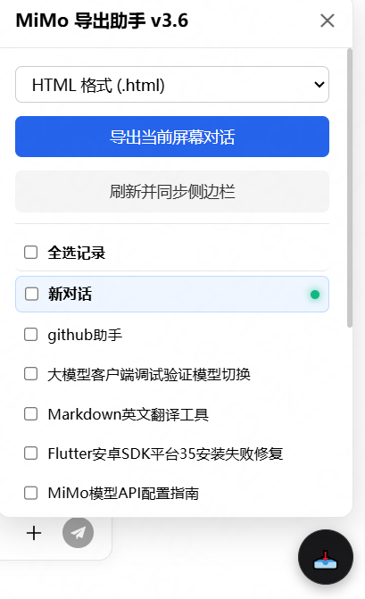

# mimo-export

MiMo AI Studio 对话导出工具，支持将对话记录导出为 HTML、Markdown、TXT 格式。

A userscript to export conversations from Xiaomi MiMo AI Studio as HTML, Markdown, or TXT files.

## 预览 | Preview

## 功能 | Features

- 三种导出格式：HTML / Markdown / TXT
- 支持导出当前对话或批量导出多个对话
- 导出文件名自动使用对话标题
- 深色 UI 面板，不影响原页面体验

## 安装 | Install

1. 安装 [Tampermonkey](https://www.tampermonkey.net/) 浏览器扩展
2. 新建脚本，粘贴 `mimo-export导出脚本.js` 中的代码并保存
3. 打开 [aistudio.xiaomimimo.com](https://aistudio.xiaomimimo.com/)，页面右下角出现导出按钮

## 使用 | Usage

- 点击右下角按钮打开面板
- **导出当前对话** — 点击「导出当前对话」按钮
- **批量导出** — 点击「刷新」扫描侧边栏，勾选对话后点击「导出选中对话」

## 许可 | License

MIT
